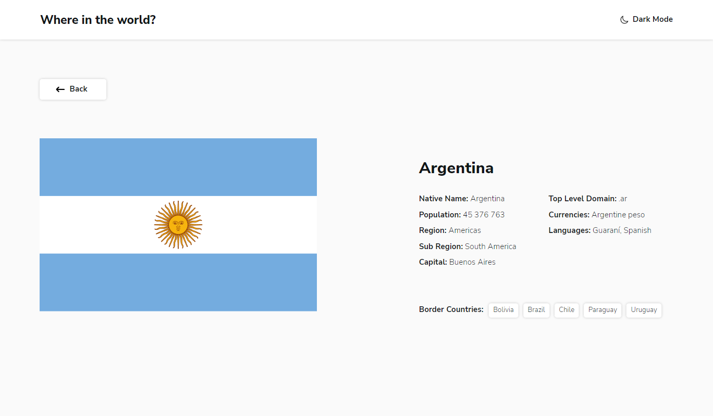

# Project - Countries Info

The project is a multi-page website with information about countries. Completed as part of an assignment of the [Frontend Mentor website](https://www.frontendmentor.io). The information about countries is provided by the [REST Countries API](https://restcountries.com).

## Table of contents

- [Project overview](#project-overview)
  - [Project objectives](#project-objectives)
  - [Project functionality](#project-functionality)
  - [Screenshot](#screenshot)
  - [Project directories](#project-directories)
  - [Project launch](#project-launch)
  - [Links](#links)
- [Project progress](#project-progress)
  - [Technologies used](#technologies-used)
  - [What I learned](#what-i-learned)
- [Author](#author)

## Project overview

### Project objectives

Provide users with information about countries, their capitals, languages, currency, population and borders.

### Project functionality

- View brief information about all countries on the main page
- Search for a country by name
- Filter countries by region
- Show detailed information about the country on a separate page
- Switch to the border country using the links on the detailed view page
- Change color scheme between light and dark themes

### Screenshot

### Project directories

- `src/assets` — directory with static files
- `src/components` — directory with components
- `src/lib` — directory with library files
- `src/pages` — directory with page root files
- `src/utils` — directory with utilities

### Project launch

- `npm run build` — start a project in production mode
- `npm run dev` — starting a project in development mode (without starting webpack-dev-server)
- `npm start` — start a project in development mode

### Links

- [Link to the project repository](https://github.com/Bjorn86/countries-info)
- [Link to the demo page of the project](https://bjorn86.github.io/countries-info/)

## Project progress

### Technologies used

- HTML
- SCSS
- JS
- [React](https://react.dev/)
- [React Router](https://reactrouter.com/en/main)
- [react-helmet-async](https://www.npmjs.com/package/react-helmet-async)
- Adaptive layout
- Semantic layout

### What I learned

- Working with accessibility of the application and management of page elements using the keyboard
- Working with styles using SCSS
- Organizing the search and filtering of content
- Working with different types of data received from REST API and processing them
- Working with page headers and metadata in the context of a React-based SPA

## Author

**Danila Legkobytov**

- e-mail: [legkobytov-danila@yandex.ru](mailto:legkobytov-danila@yandex.ru)
- LinkedIn: [in/danila-legkobytov](https://www.linkedin.com/in/danila-legkobytov/)
- Telegram: [@danila_legkobytov](https://t.me/danila_legkobytov)
- Frontend Mentor: [@danila_legkobytov](https://www.frontendmentor.io/profile/Bjorn86)
