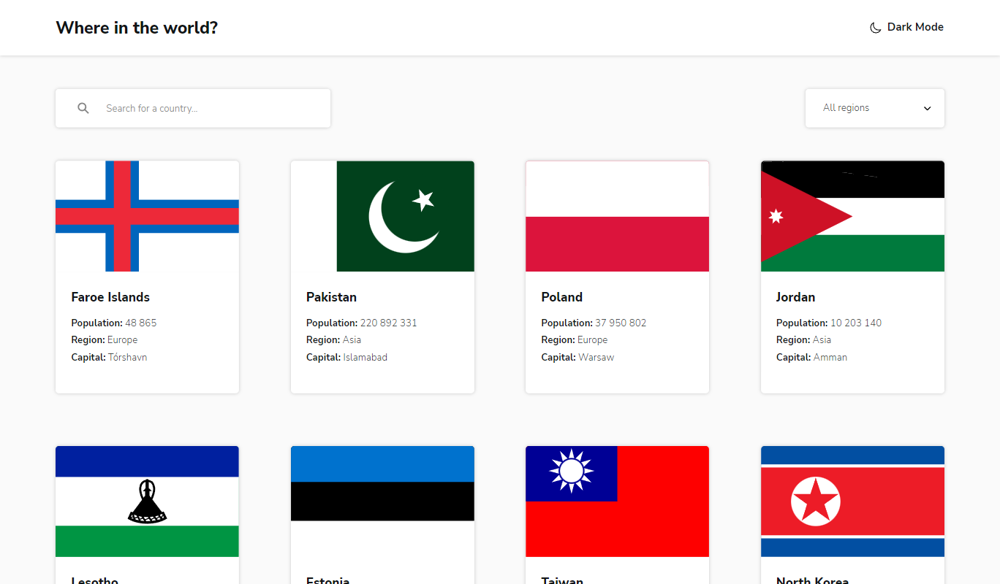
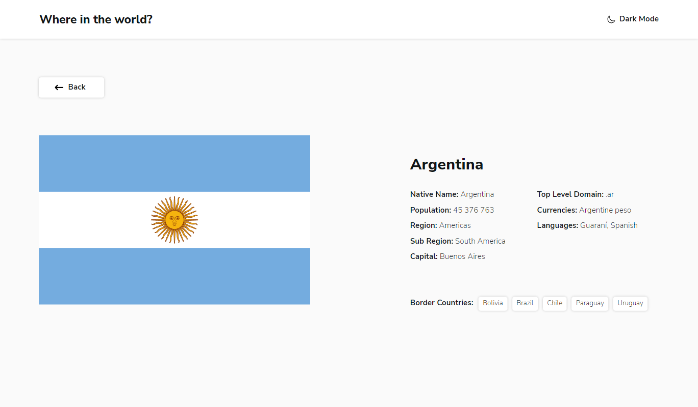

# Проект - Countries Info

[README in English](./README-en.md)

Проект представляет из себя многостраничный сайт, предоставляющий информацию о странах. Выполнен в рамках задания с сайта [Frontend Mentor](https://www.frontendmentor.io). Информация о странах предоставляется [REST Countries API](https://restcountries.com).

## Оглавление

- [Обзор проекта](#обзор-проекта)
  - [Задачи проекта](#задачи-проекта)
  - [Функциональность проекта](#функциональность-проекта)
  - [Screenshot](#screenshot)
  - [Директории проекта](#директории-проекта)
  - [Запуск проекта](#запуск-проекта)
  - [Ссылки](#ссылки)
- [Ход выполнения проекта](#ход-выполнения-проекта)
  - [Используемые технологии](#используемые-технологии)
  - [Чему я научился работая над проектом](#чему-я-научился-работая-над-проектом)
- [Автор](#автор)

## Обзор проекта

### Задачи проекта

Предоставить пользователям информацию о странах, их столицах, языках, валюте, населении, границах.

### Функциональность проекта

- Просмотр краткой информации о всех странах на главной странице
- Поиск страны по названию
- Фильтрация стран по региону
- Просмотр детальной информации о стране на отдельной странице
- Переход к приграничной стране через ссылки на странице детального просмотра
- Изменение цветовой схемы между светлой и тёмной темами

### Screenshot

### Директории проекта

- `src/assets` — директория со статичными файлами
- `src/components` — директория с компонентами
- `src/lib` — директория с файлами библиотек
- `src/pages` — директория с корневыми файлами страниц
- `src/utils` — директория со вспомогательными утилитами

### Запуск проекта

- `npm run build` — запуск проекта в режиме продакшн
- `npm run dev` — запуск проекта в режиме разработки (без запуска webpack-dev-server)
- `npm start` — запуск проекта в режиме разработки

### Ссылки

- [Ссылка на репозиторий проекта](https://github.com/Bjorn86/countries-info)
- [Ссылка на демо-страницу проекта](https://bjorn86.github.io/countries-info/)

## Ход выполнения проекта

### Используемые технологии

- HTML
- SCSS
- JS
- [React](https://react.dev/)
- [React Router](https://reactrouter.com/en/main)
- [react-helmet-async](https://www.npmjs.com/package/react-helmet-async)
- Адаптивная вёрстка
- Семантическая вёрстка

### Чему я научился работая над проектом

- Работе с доступностью приложения и управлению элементами страницы с помощью клавиатуры
- Работе со стилями с помощью SCSS
- Организации поиска и фильтрации контента
- Работе с различными типа данных получаемых от REST API, и их обработке
- Работе с заголовками страниц и метаданными, в рамках SPA построенного на React

## Автор

**Данила Легкобытов**

- e-mail: [legkobytov-danila@yandex.ru](mailto:legkobytov-danila@yandex.ru)
- LinkedIn: [in/danila-legkobytov](https://www.linkedin.com/in/danila-legkobytov/)
- Telegram: [@danila_legkobytov](https://t.me/danila_legkobytov)
- Frontend Mentor: [@danila_legkobytov](https://www.frontendmentor.io/profile/Bjorn86)
